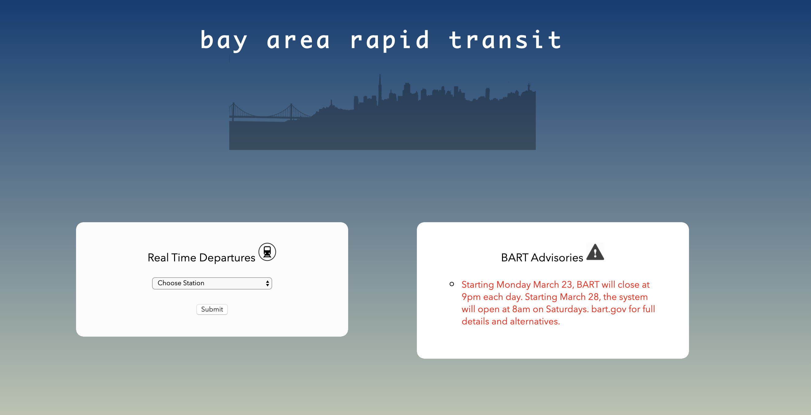
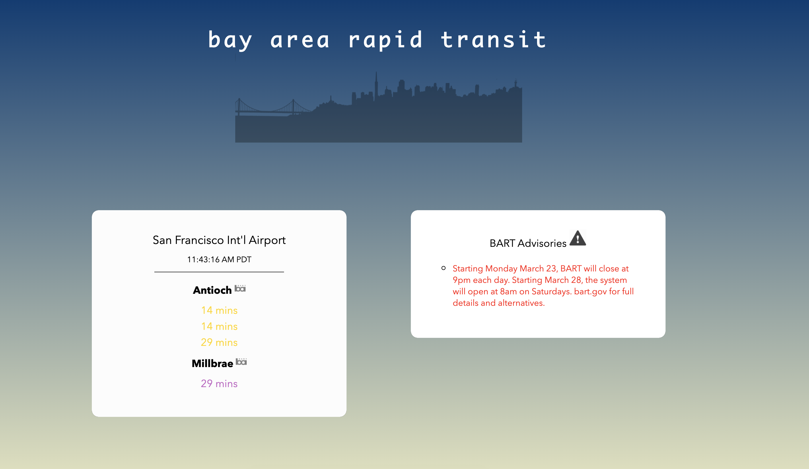

# BART Status App

### Summary:
A simple BART Status app where you can easily choose your local BART station and find real-time departure information of all subway lines.

### Motivation:
I wanted to build an app where users can easily find out the next departures in a BART station of interest, in 2 clicks maximum. BART riders can also find out all real-time advisories and important information regarding BART stations with no clicks at all.

### Technologies Used:
HTML/CSS/JavaScript/jQuery

### Screenshots:

